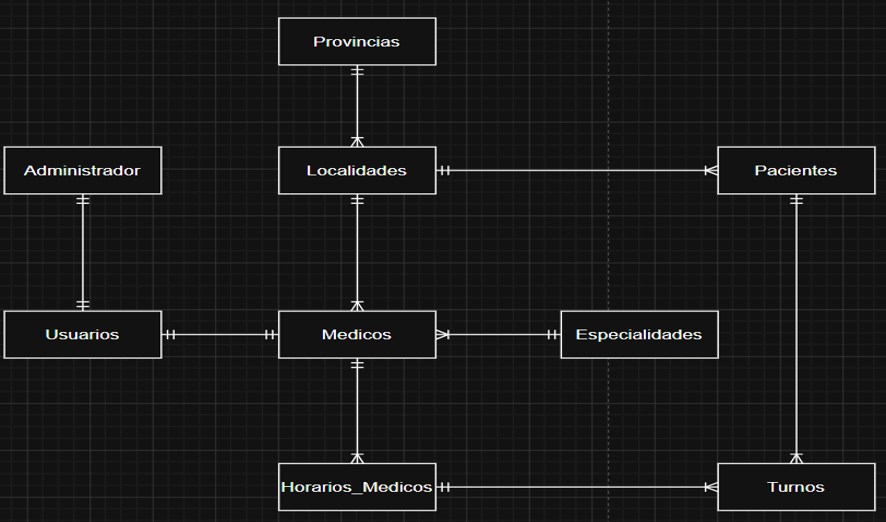
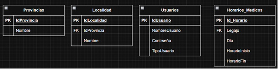
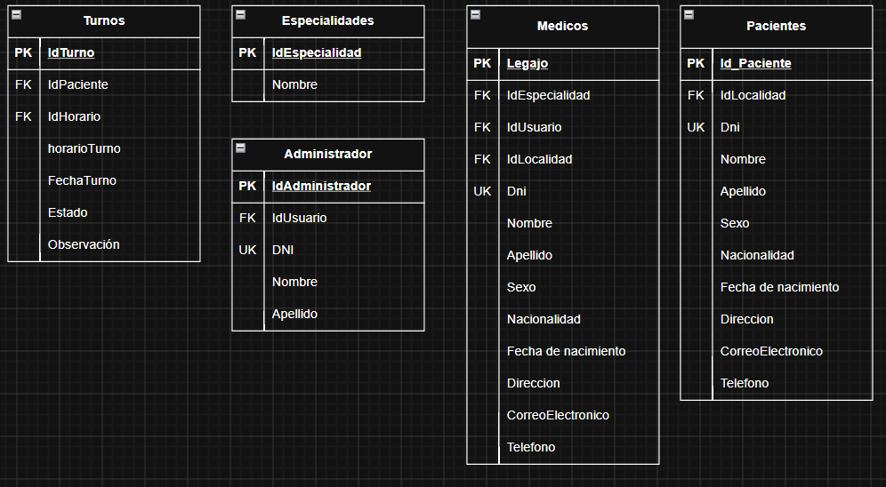
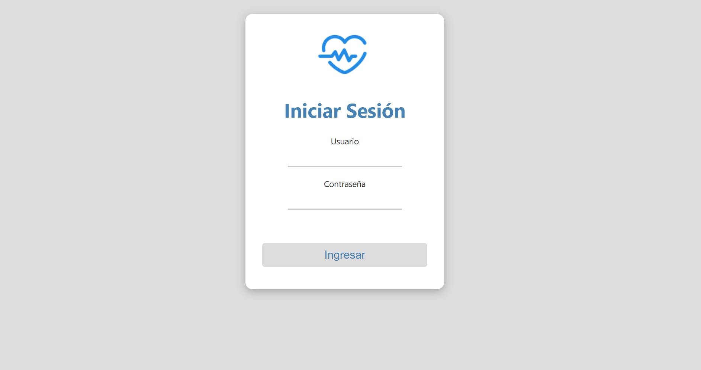
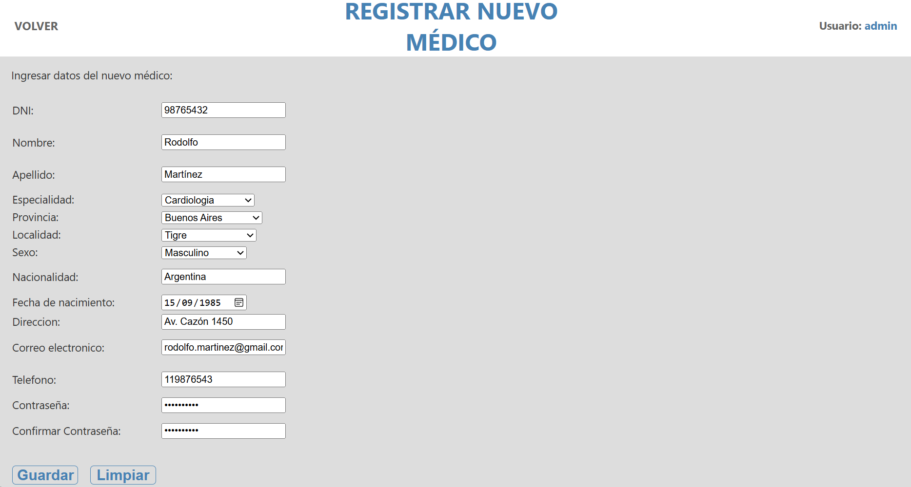
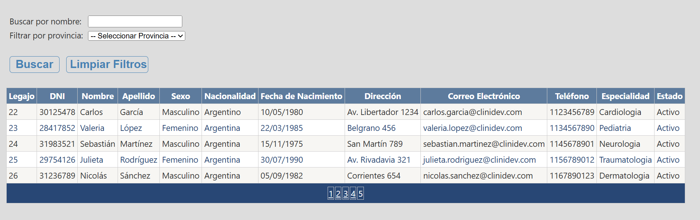
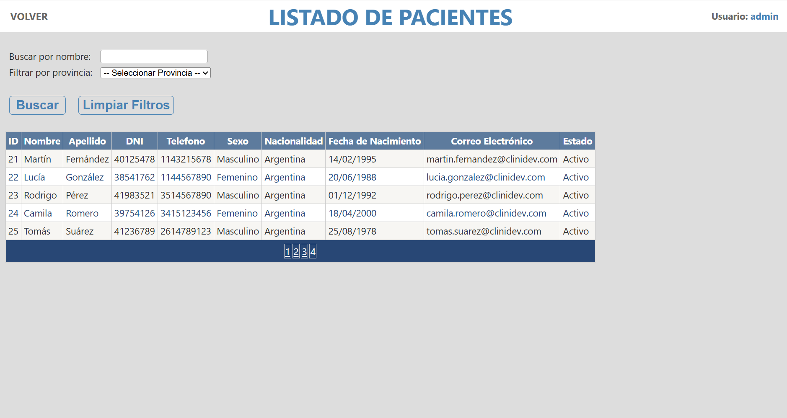
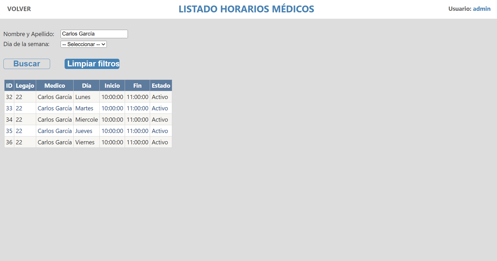
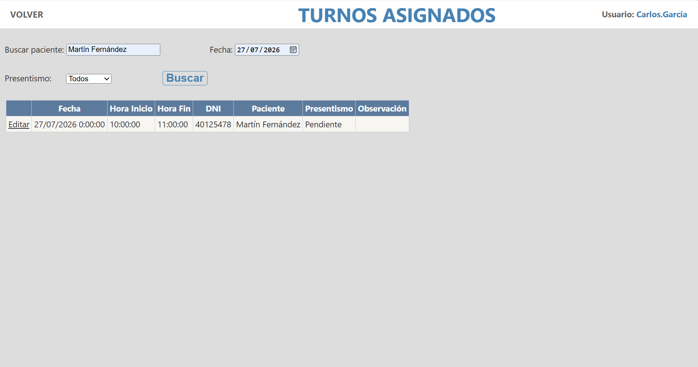

# Clinidev - Sistema de Gestión Clínica

Trabajo Práctico Integrador de la materia Programación III - Tecnicatura Universitaria en Programación (TUP), UTN FRGP.

## Objetivo

Sistema de gestión para clínicas médicas que centraliza la administración de médicos, pacientes, turnos, horarios e informes.

El proyecto busca resolver un problema real presente en muchos centros de salud: reemplazar planillas y procesos manuales mediante una plataforma que permita organizar y optimizar la gestión diaria.

## Tecnologías

- ASP.NET WebForms
- C#
- SQL Server
- CSS

## Arquitectura

El sistema está desarrollado utilizando una arquitectura en tres capas:

- **Entidades**: clases que representan los objetos del dominio (Médico, Paciente, Turno, Usuario, etc.)
- **Datos**: acceso a base de datos mediante conexiones, adaptadores y procedimientos almacenados
- **Negocio**: lógica de validación y procesamiento
- **Vistas**: interfaz de usuario desarrollada con ASP.NET WebForms

## Modelo Entidad-Relación

## Interfaz del sistema

Algunas pantallas principales de Clinidev:

### Inicio de sesión

### Alta de médicos

### Gestión de médicos

### Gestión de pacientes

### Gestión de horarios médicos

### Gestión de turnos asignados

## Funcionalidades principales

- Gestión de médicos (alta, baja lógica, modificación y listado)
- Gestión de pacientes (alta, baja lógica, modificación y listado)
- Administración de horarios médicos
- Asignación y gestión de turnos
- Informes estadísticos:
  - Ausentismo
  - Demanda por especialidad
  - Mapa de demanda
  - Pacientes por fecha
- Sistema de usuarios con roles (Administrador y Médico)

## Documentación

La documentación completa del proyecto se encuentra disponible en la carpeta [`/docs`](./docs).

## Equipo

- Leonardo Farid Tello Moscoso
- Thiago Pinza
- Matías Giménez
- Matías Romano
- Agustín Romano
- Brandon Avendaño

---

# Clinidev - Clinical Management System

Final integrative project for Programación III - University Technician in Programming (TUP), UTN FRGP.

## Objective

A clinical management system that centralizes the administration of doctors, patients, appointments, schedules, and reports.

The project addresses a real-world problem faced by healthcare centers: replacing spreadsheets and manual processes with a centralized platform that improves daily management efficiency.

## Technologies

- ASP.NET WebForms
- C#
- SQL Server
- CSS

## Architecture

The system follows a three-layer architecture:

- **Entities**: domain model classes (Doctor, Patient, Appointment, User, etc.)
- **Data**: database access layer using connections, adapters, and stored procedures
- **Business**: validation and processing logic
- **Views**: user interface developed with ASP.NET WebForms

## Main features

- Medical staff management (create, logical delete, update, list)
- Patient management (create, logical delete, update, list)
- Doctor schedule management
- Appointment assignment and management
- Statistical reports:
  - Absenteeism
  - Demand by specialty
  - Demand map
  - Patients by date
- Role-based user system (Administrator and Doctor)

## Documentation

The full project documentation is available in the [`/docs`](./docs) folder.

## Team

- Leonardo Farid Tello Moscoso
- Thiago Pinza
- Matías Giménez
- Matías Romano
- Agustín Romano
- Brandon Avendaño

Nota Final 10 (diez).